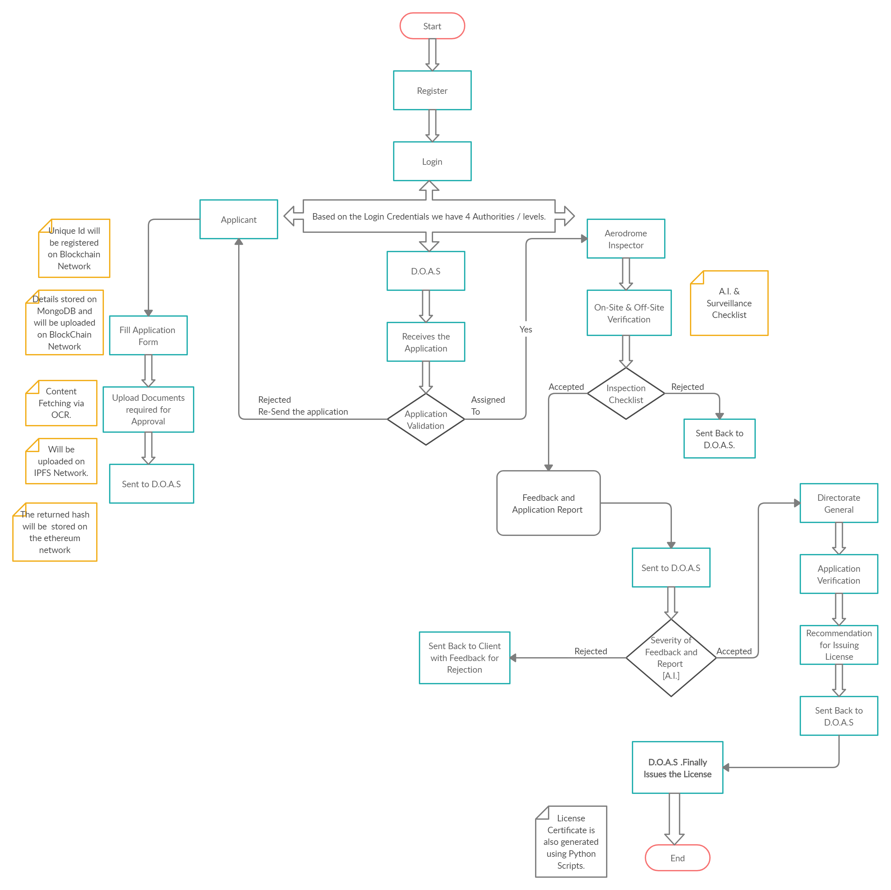

# SIH2020  Blockchain Based KMP(Airport Authority Of India Project)

<h1> Flow Diagram of the Project </h1>

## Problem Statement
A web Based application using **Blockchain** technology is sought from **Airport Licensing** to retrive 
important and relevant **Project related information from of pool of data source i.e, SAP, E-mail, E-Office, Scan documents and DataBase**. Below features are desired in an application:
- Concerned Officers can **upload relevant data** related to Airport Licensing from Airports
- **Seamless Approval process**, **centralized Monitoring** and **suggestion Mechanism**
- **Relevant information should be fetched from data source**, linked to a particular project which can be used in the hour of need

## Our Approach and Solution
- We need to make scripts to fetch data from emails, scan documents and other relevant sources
- we need to make a central database, most probably have to use cloud to store data
- We need to make Approval mechanism over blockchain
- we need to make centralised monitoring system(All the data need to be seen easily by all members or the officers concerned)
- We need to develop Feedback Mechanism to tell back the client that this is wrong you need to change it
- we need to make a system that will show and store important data easily
- The data provided by emails and other sources should be analysed and which data need to be stored and what not need to be determined

## Links to read about Airport licensing
[Link 1](https://www.aai.aero/en/content/aerodrome-licensing)
[Link 2](https://www.aai.aero/en/content/aerodrome-licensing-0)
[Link 3](https://www.civilaviation.gov.in/sites/default/files/moca_000939_0.pdf)
[Link 4](https://www.icao.int/Meetings/AMC/Assembly37/Working%20Papers%20by%20Number/wp087_en.pdf)
[Link 5](https://www.civilaviation.gov.in/sites/default/files/moca_001421.pdf)
[Link 6](https://www.google.com/url?sa=t&source=web&rct=j&url=http://164.100.60.133/manuals/ProceMan_Aero.pdf&ved=2ahUKEwiAsp6KpLrqAhUX63MBHYgADVkQFjAQegQIBxAB&usg=AOvVaw0IvBy_6wyaF6OM4BMWFchW)

## Team Hexa-Techies
- Mohit Bhat and Avinash Kumar=>Blockchain and Backend
- Aditiya Singh and K.Manohar=>AI 
- Chahat Bindra and M.Vineeth=>Frontend

